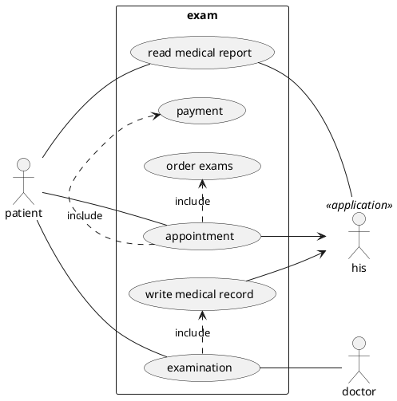
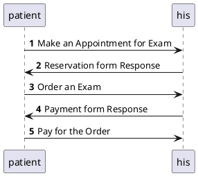
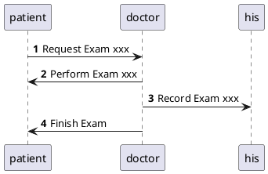
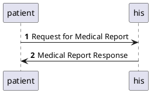

# microservice-physical-exam
a microservice demo for physical examination.

[体检](https://en.wikipedia.org/wiki/Physical_examination)，也称做身体检查、理学检查或健康检查，是医生检查病人身体，以确定其是否有某种疾病的迹象或症状的过程。它通常包括一系列关于病人病史的问题，然后检查症状。病史和体格检查有助于确定正确的诊断和制定治疗计划。这些数据成为医疗记录的一部分。

## Use Cases

## Sequence Diagrams

### Appointment

### Examination

### Medical Report

## Environment

### mysql

`docker run -it --network baas --rm mariadb:10.3 mysql -hphysical-exam-mysql -uroot -psecret`