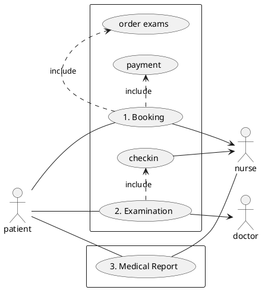
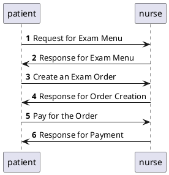
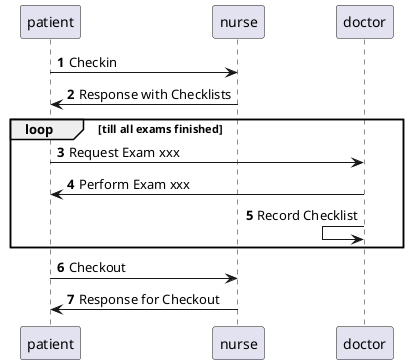
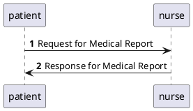

# microservice-physical-exam
a microservice demo for physical examination.

[体检](https://en.wikipedia.org/wiki/Physical_examination)，也称做身体检查、理学检查或健康检查，是医生检查病人身体，以确定其是否有某种疾病的迹象或症状的过程。它通常包括一系列关于病人病史的问题，然后检查症状。病史和体格检查有助于确定正确的诊断和制定治疗计划。这些数据成为医疗记录的一部分。

## Use Cases



## Sequence Diagrams

### 1. Booking



### 2. Examination



### 3. Report



## Domain Models

### Models

- `ExamItem` Physical Examination Items, such as General, HEENT and so on
- `Order` Order for a phicical exam, with state such as init/paid/subscribe/complete
- `Checklist` Patient's checklist

### DB Schema

```mysql
-- t_exam_item
+-------------+--------------+--------+-------+-----------------------+-------------
| Field       | Type         | Null   | Key   | Default               | Comment     
|-------------+--------------+--------+-------+-----------------------+-------------
| id          | bigint(20)   | NO     | PRI   | <null>                | 主键ID      
| create_time | timestamp    | NO     |       | current_timestamp()   | 创建时间    
| update_time | timestamp    | NO     |       | '0000-00-00 00:00:00' | 更新时间    
| name        | varchar(255) | NO     |       | <null>                | 体检项目名称
| content     | varchar(512) | NO     |       | <null>                | 具体内容    
| price       | bigint(20)   | YES    |       | 0                     | 项目费用    
+-------------+--------------+--------+-------+-----------------------+-------------

-- t_order/t_order_item
+-------------+--------------+--------+-------+-----------------------+-------------------------------
| Field       | Type         | Null   | Key   | Default               | Comment                       
|-------------+--------------+--------+-------+-----------------------+-------------------------------
| id          | bigint(20)   | NO     | PRI   | <null>                | 主键ID                        
| create_time | timestamp    | NO     |       | current_timestamp()   | 创建时间                      
| update_time | timestamp    | NO     |       | '0000-00-00 00:00:00' | 更新时间                      
| patient     | varchar(255) | NO     |       | <null>                | 检查者                        
| total       | bigint(20)   | YES    |       | 0                     | 订单费用                      
| state       | tinyint(4)   | NO     |       | <null>                | 订单状态，详见enums.OrderState
+-------------+--------------+--------+-------+-----------------------+-------------------------------

+----------+------------+--------+-------+-----------+----------------
| Field    | Type       | Null   | Key   | Default   | Comment        
|----------+------------+--------+-------+-----------+----------------
| order_id | bigint(20) | NO     |       | <null>    | 外键-订单ID    
| item_id  | bigint(20) | NO     |       | <null>    | 外键-体检项目ID
+----------+------------+--------+-------+-----------+----------------

-- t_checklist
+------------+--------------+--------+-------+---------------------+----------------
| Field      | Type         | Null   | Key   | Default             | Comment        
|------------+--------------+--------+-------+---------------------+----------------
| order_id   | bigint(20)   | NO     |       | <null>              | 外键-订单ID    
| item_id    | bigint(20)   | NO     |       | <null>              | 外键-体检项目ID
| check_time | timestamp    | NO     |       | current_timestamp() | 检查时间       
| doctor     | varchar(255) | YES    |       | NULL                | 检查医生       
| record     | varchar(512) | YES    |       | NULL                | 检查记录       
| state      | tinyint(4)   | YES    |       | NULL                | 项目检查状态， 
+------------+--------------+--------+-------+---------------------+----------------
```

## Environment

Run with `docker-compose up -d`

### mysql

`docker run -it --network baas --rm mariadb:10.3 mysql -hphysical-exam-mysql -uphysical-exam -pphysical-exam`